# Diagram Use Case - Sistem SIMDIK Kota Banjarmasin

## Use Case Diagram

```mermaid
graph TB
    %% Actors
    Admin[👤 Admin]
    Pengunjung[👤 Pengunjung]
    
    %% System Boundary
    subgraph "Sistem SIMDIK"
        %% Admin Use Cases
        UC1[Kelola Dashboard]
        UC2[Kelola Data Sekolah]
        UC3[Kelola Berita]
        UC4[Kelola Agenda]
        UC5[Kelola Reservasi]
        UC6[Lihat Laporan]
        UC7[Export Data]
        
        %% Pengunjung Use Cases
        UC8[Lihat Beranda]
        UC9[Reservasi Online]
        UC10[Lihat Berita]
        UC11[Lihat Agenda]
        UC12[Lihat Direktori Sekolah]
        UC13[Lihat Tentang SIMDIK]
        UC14[Login Admin]
        UC15[Lihat Statistik Pendidikan]
        UC16[Lihat Kontak]
    end
    
    %% Admin Relationships
    Admin --> UC1
    Admin --> UC2
    Admin --> UC3
    Admin --> UC4
    Admin --> UC5
    Admin --> UC6
    Admin --> UC7
    Admin --> UC14
    
    %% Pengunjung Relationships
    Pengunjung --> UC8
    Pengunjung --> UC9
    Pengunjung --> UC10
    Pengunjung --> UC11
    Pengunjung --> UC12
    Pengunjung --> UC13
    Pengunjung --> UC15
    Pengunjung --> UC16
    
    %% Include Relationships
    UC2 -.->|include| UC1
    UC3 -.->|include| UC1
    UC4 -.->|include| UC1
    UC5 -.->|include| UC1
    UC6 -.->|include| UC1
    
    %% Extend Relationships
    UC9 -.->|extend| UC8
    UC10 -.->|extend| UC8
    UC11 -.->|extend| UC8
    UC12 -.->|extend| UC8
    UC13 -.->|extend| UC8
    UC15 -.->|extend| UC8
    UC16 -.->|extend| UC8
```

## Detail Use Cases

### Admin Use Cases:
1. **UC1 - Kelola Dashboard**: Mengelola dashboard utama dengan statistik dan ringkasan data
2. **UC2 - Kelola Data Sekolah**: CRUD operations untuk data sekolah (tambah, edit, hapus, lihat)
3. **UC3 - Kelola Berita**: CRUD operations untuk berita dan pengumuman
4. **UC4 - Kelola Agenda**: CRUD operations untuk agenda dan kegiatan
5. **UC5 - Kelola Reservasi**: Mengelola dan memproses reservasi dari pengunjung
6. **UC6 - Lihat Laporan**: Melihat laporan dan statistik sistem
7. **UC7 - Export Data**: Mengekspor data dalam berbagai format
8. **UC14 - Login Admin**: Autentikasi admin untuk mengakses sistem

### Pengunjung Use Cases:
1. **UC8 - Lihat Beranda**: Mengakses halaman utama sistem
2. **UC9 - Reservasi Online**: Membuat reservasi layanan pendidikan
3. **UC10 - Lihat Berita**: Membaca berita dan pengumuman
4. **UC11 - Lihat Agenda**: Melihat agenda dan kegiatan
5. **UC12 - Lihat Direktori Sekolah**: Mencari dan melihat informasi sekolah
6. **UC13 - Lihat Tentang SIMDIK**: Mengakses informasi tentang sistem
7. **UC15 - Lihat Statistik Pendidikan**: Melihat data statistik pendidikan
8. **UC16 - Lihat Kontak**: Mengakses informasi kontak

## Relasi Use Case:
- **Include**: Use case yang harus dipanggil oleh use case lain
- **Extend**: Use case yang dapat memperluas use case lain secara opsional
